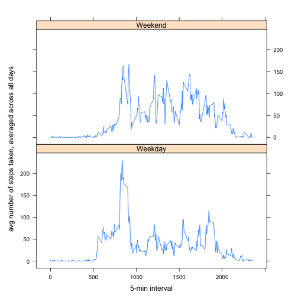

### Prepare the environment

```r
rm(list=ls())
```
---
### Part 1. Loading and preprocessing the data
Read in data and save it into dat_src as a data frame


```r
dat_src <-read.csv("~/Documents/Rwork/ReproducibleResearch/RepData_PeerAssessment1/activity.csv")
summary(dat_src)
```

```
##      steps                date          interval     
##  Min.   :  0.00   2012-10-01:  288   Min.   :   0.0  
##  1st Qu.:  0.00   2012-10-02:  288   1st Qu.: 588.8  
##  Median :  0.00   2012-10-03:  288   Median :1177.5  
##  Mean   : 37.38   2012-10-04:  288   Mean   :1177.5  
##  3rd Qu.: 12.00   2012-10-05:  288   3rd Qu.:1766.2  
##  Max.   :806.00   2012-10-06:  288   Max.   :2355.0  
##  NA's   :2304     (Other)   :15840
```

```r
class(dat_src)
```

```
## [1] "data.frame"
```


### Part 2. Mean total number of steps taken perday

Step 2.1 Ignore missing values

```r
dat_src_noNA <- dat_src[!is.na(dat_src[,1]),]
```

Step 2.2 make a histogram of the total number of steps taken each day
Step 2.2.1 Find the total steps

```r
stepPerDay <- tapply(dat_src_noNA$steps, dat_src_noNA$date, sum)
```
Step 2.2.2 Create the plot

```r
hist(stepPerDay,xlab = "Total number of steps taken each day")
```

 

Step 2.3 Calculate and report the mean and median total number  of steps taken per day

```r
stepPerDay_mean <- mean(stepPerDay,na.rm=T)
stepPerDay_median <- median(stepPerDay,na.rm=T)
print(stepPerDay_mean)
```

```
## [1] 10766.19
```

```r
print(stepPerDay_median)
```

```
## [1] 10765
```

### Part 3. What is the average daily activity pattern

Step 1. Make a time series plot of the 5-min interval and the avg number of steps taken, averaged across all days

```r
avgStepPerDay <- tapply(dat_src_noNA$steps, dat_src_noNA$interval, mean, na.rm = T)
interval <- as.numeric(levels(factor(dat_src_noNA$interval)))
plot(as.numeric(avgStepPerDay)~interval,type = "l",xlab="5-min interval",ylab="avg number of steps taken, averaged across all days")
```

 

Step 2. Which 5-minute interval, on average across all the days in the dataset, contains the maximum number of steps?

```r
maxNumStep <- interval[which.max(avgStepPerDay)]
print(maxNumStep)
```

```
## [1] 835
```


### Part 4.
Imputing missing values

Step 1. Find total number of NA

```r
sum(is.na(dat_src))
```

```
## [1] 2304
```

Step 2. Fill with mean for that 5-minute interval

```r
dat_src_filled <- dat_src
for (i in 1:nrow(dat_src_filled)){
  # Go through every row for filling
  if(is.na(dat_src_filled[i,1])==TRUE){
    # Find missing step row
    index <- which(interval == dat_src_filled[i,3])
    # Locate the intended filler
    dat_src_filled[i,1] <- avgStepPerDay[index]
    # Fill with mean of day
  }
}
```
Show every NA has been replaced

```r
sum(is.na(dat_src_filled))
```

```
## [1] 0
```

Step 3. Histogram, mean and median 


```r
stepPerDay_filled <- tapply(dat_src_filled$steps, dat_src_filled$date, sum)
```


```r
hist(stepPerDay_filled,xlab = "Total number of steps taken each day[filled]")
```

 

```r
filled_mean <- mean(stepPerDay_filled,na.rm=F)
filled_median <- median(stepPerDay_filled,na.rm=F)
print(filled_mean)
```

```
## [1] 10766.19
```

```r
print(filled_median)
```

```
## [1] 10766.19
```

Clearly, the filling did not move the mean around at all. However, because of the filling, the new is different from the old one by one, which makes no impact on prediction/estimation.

### Part 5 Weekend pattern

Step 1. Create new factor

```r
dat_src_filled[,"weekFactor"]<-weekdays(as.Date(dat_src_filled[, 2]))
dat_src_filled$weekFactor[dat_src_filled$weekFactor == "Sunday"] <- "Weekend"
dat_src_filled$weekFactor[dat_src_filled$weekFactor == "Saturday"] <- "Weekend"
dat_src_filled$weekFactor[!dat_src_filled$weekFactor == "Weekend"] <- "Weekday"
dat_src_filled$weekFactor <- factor(dat_src_filled$weekFactor)
```

Step 2. Make a panel plot containing a time series plot of 5- min interval

```r
ag = aggregate(steps ~ interval + weekFactor, dat_src_filled, mean)
library(lattice)
xyplot(steps ~ interval | factor(weekFactor),data = ag,type="l",aspect=1/2,xlab="5-min interval",ylab="avg number of steps taken, averaged across all days")
```

 
